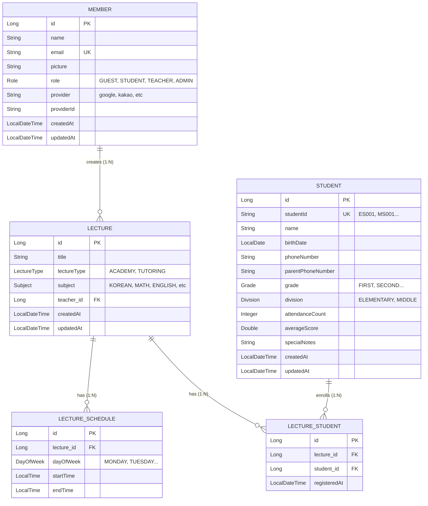

# Academy Management System ERD

> **작성일:** 2024.01.06  
> **프로젝트:** Academy Management  
> **주제:** 현재 구현된 도메인 엔티티들의 관계도 (Entity Relationship Diagram)

---

## 1. ERD (Mermaid)

---

## 2. 엔티티 상세 설명

### 2.1 MEMBER (회원)
*   시스템을 사용하는 사용자(주로 강사)입니다.
*   OAuth2 로그인을 통해 생성되며, `email`을 고유 식별자로 사용합니다.
*   `Role`을 통해 권한을 관리합니다.

### 2.2 LECTURE (강의)
*   강사가 개설한 강의 정보입니다.
*   `teacher_id`를 통해 개설한 강사(`MEMBER`)와 연결됩니다. (N:1)
*   강의 타입(학원/과외)과 과목 정보를 가집니다.

### 2.3 LECTURE_SCHEDULE (강의 시간표)
*   강의의 요일별 시간표 정보입니다.
*   하나의 강의는 여러 개의 스케줄을 가질 수 있습니다. (1:N)
*   `Lecture`가 삭제되면 스케줄도 함께 삭제됩니다 (`CascadeType.ALL`).

### 2.4 STUDENT (학생)
*   학원에 등록된 학생 정보입니다.
*   `studentId` (학번)를 고유 식별자로 가집니다.
*   학년(`Grade`)과 구분(`Division`) 정보를 가집니다.

### 2.5 LECTURE_STUDENT (수강생 - 중간 엔티티)
*   **다대다(N:M) 관계 해결을 위한 핵심 엔티티**입니다.
*   `LECTURE`와 `STUDENT`를 연결합니다.
*   `lecture_id`와 `student_id` 조합은 유니크해야 합니다 (중복 수강 방지).
*   `registeredAt`을 통해 언제 수강 등록되었는지 기록합니다.
